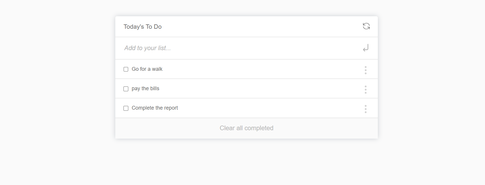

# To-Do-List

A "To-do list" is a tool that helps to organize your day. It simply lists the things that you need to do and allows you to mark them as complete. I have built a simple website that allows for doing that and has done it using ES6 and Webpack!


## Built With

- ES6
- webpack, webpack-cli
- html-webpack-plugin
- style-loader, css-loader
- webpack-dev-server


## Live Demo

[Live Demo Link]( https://maha-magdy.github.io/To-Do-List/ )

## Getting Started

**To get a local copy up and running follow these simple steps.**

### Prerequisites

- Windows, Mac or Linux machine 

### Setup

- Clone this repo run this code on a terminal window: 

```
git clone https://github.com/Maha-Magdy/To-Do-List.git
```

- Install needed webpack packages
```
npm install
```

- Run local server
```
npm run start
```

### Usage

- Put this url in your browser http://localhost:8080/, and start use To-do list.
  

## Author

👤 **Maha Magdy**

- GitHub: [Maha-Magdy](https://github.com/Maha-Magdy)
- Twitter: [@Maha_M_Abdelaal](https://twitter.com/Maha_M_Abdelaal)
- LinkedIn: [Maha Magdy](https://www.linkedin.com/in/maha-magdy-abdelaal/)


## 🤝 Contributing

Contributions, issues, and feature requests are welcome!

Feel free to check the [issues page]( https://github.com/Maha-Magdy/To-Do-List/issues ).

## Show your support

Give a ⭐️ if you like this project!

## Acknowledgments

- [webpack](https://webpack.js.org/)

## 📝 License

This project is [MIT](./LICENSE) licensed.


